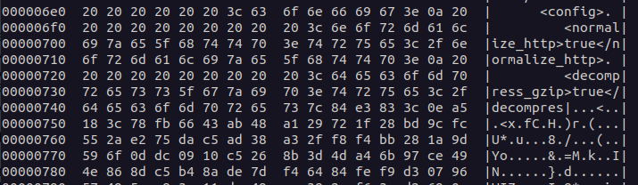

# Overview

> ## Secure Config
> **Description**\
> I've decided to secure the xml config of my app to keep prying eyes out. A little XOR magic later, and now its completely unreadable. This crypto stuff is easy!
>
> **Assets**\
> secure_config.zip

# Walkthrough

Extracting secure_config.zip, we find three files: 
* config.enc
* test_config.xml
* test_config.enc

It appears that test_config.enc is the encrypted version of test_config.xml and we would need to figure out how to decrypt config.enc to get the flag. Since the description mentions xor, we’ll start by doing an xor of the bytes in the two test_config files to get the key used.

```python
""" solve.py """
pt_file = 'test_config.xml'
ct_file = 'test_config.enc'
key_file = 'keyfile'

with open(pt_file, 'rb') as f:
    pt_buff = f.read()

with open(ct_file, 'rb') as f:
    ct_buff = f.read()

key = [pt_buff[i] ^ ct_buff[i] for i in range(len(pt_buff))]

with open(key_file, 'wb') as f:
    f.write(bytearray(key))
```

Next, let’s try applying that key to config.enc
```python
config_enc_file = 'config.enc'
with open(config_enc_file, 'rb') as f:
    config_enc = f.read()

decrypted = bytearray(
    [config_enc[i] ^ key[i % len(key)] for i in range(len(config_enc))]
)

with open('decr_config.xml', 'wb') as f:
    f.write(decrypted)
```
Looking at the contents of decr.txt, we see that only the first 1865 characters were successfully decrypted.



There are a few strategies we can try to see if we are missing the remainder of the key, or if they key might repeat at a shorter interval than what we used. Given the plaintext is XML, we can also leverage the structured nature in known plaintext attacks.

To start off, we should examine the keyfile we saved earlier. When we open the file in a hex editor, some repeating patterns stand out. It seems there are a few common sequences in the lower nibbles.


These sequences seem to repeat every 0x100 bytes, but only for the lower nibbles, so the key probably repeats at a larger interval than what we have extracted.

Assuming the first 16 bytes are the starting key values, we can compare those to the next set of 16 bytes and determine that those are derived as the result of adding 0x3d to each byte modulo 0x100. 
```
(0x11 + 0x3D) % 0x100 = 0x4E
(0x67 + 0x3D) % 0x100 = 0xA4
...
(0xB4 + 0x3D) % 0x100 = 0xF1
```

This information should allow us to generate a key stream for any length of input.

```python
key = [0x11, 0x67, 0x41, 0xe2, 0x86, 0x33, 0xc3, 0xe0,
       0x54, 0x7a, 0x18, 0x21, 0x77, 0x2f, 0xa9, 0xb4]

decrypted = bytearray([])
i = 0  # Index into the data to decrypt
while i < len(config_enc):
    # Only decrypt a key length of data or less in each loop
    to_decrypt = min([len(key), len(config_enc[i:])])

    # XOR the next set of bytes with the key
    decrypted.extend(
        [config_enc[i+j] ^ key[j % len(key)] for j in range(to_decrypt)]
    )
 
    # Rotate the key according to the guessed algorithm
    key = [(k + 0x3d) % 0x100 for k in key]
 
    # Advance the index by they amount we just decrypted
    i += len(key)

with open('decr_config.xml', 'wb') as f:
    f.write(decrypted)
```
Now we have a fully decrypted config file.\
Searching through for anything that looks like a flag we find the node:
```xml
<encoded_flag>QmFyU2lkZXN7ZDBuJzdfcjAxMV95MHVyXzB3bl9jcnlwNzB9</encoded_flag>
```
A base64 decode on the node value reveals the flag.
```
BarSides{d0n'7_r011_y0ur_0wn_cryp70}
```