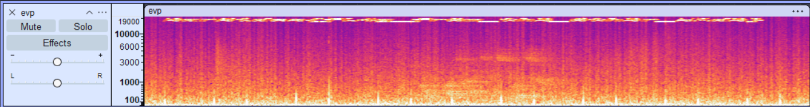
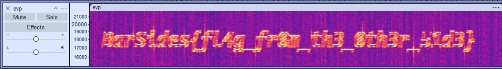

# Overview

> ## Haunted CTF
> **Description**\
> Did you know this CTF is haunted?\
>If you can believe the audacity, there is this specter we call Grahm who is known for sharing flags with high frequency.\
>Don't believe us? We've captured this EVP as proof!
>
> **Assets**\
> evp.wav

# Walkthrough

When we listen to evp.wav, we hear what sounds like an EVP recording with someone saying "join the BarSides Discord server". Doesn't sound like a flag. Fortunately, there is no shortage of hints in the description. Let's start by opening evp.wav in Audacity as suggested.


We're told the specter is named Grahm... sounds like spectrogram to me, so let's change the view from waveform to spectrogram.



Now we can see a concentration of signal near the top; the high frequency range. We can zoom into that range to find the flag.



```
BarSides{fl4g_fr0m_th3_0th3r_51d3}
``` 