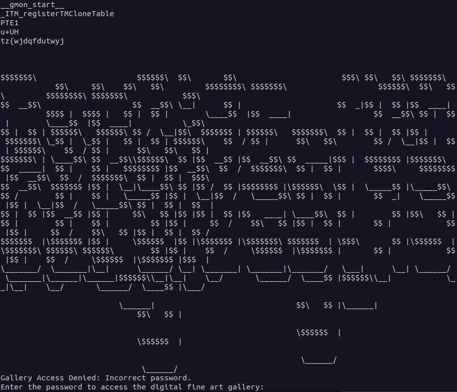

# Overview

> ## The Arts
> **Description**\
> After hearing about the Louvre heist, I've actually gotten much more interested in the arts. The traditional stuff is great, but I really love the modern retro genre. I found this digital gallery, but I can't seem to get in to view the treasures.
>
> **Assets**\
> gallery

# Walkthrough

We'll start by checking what type of file we're dealing with
```
$ file gallery 

gallery: ELF 64-bit LSB pie executable, x86-64, version 1 (SYSV), dynamically linked, interpreter /lib64/ld-linux-x86-64.so.2, BuildID[sha1]=9e118457aa9d54bdd6c5af852cc7cfea50a1d7f9, for GNU/Linux 3.2.0, not stripped
```
We next check what strings are contained in the file, but we see some odd output


When we adjust the terminal window, we notice some of the lines start to shift, indicating that we're dealing with wrapping of long lines. Let's try again, this time capturing the output of strings to a file

```
strings -n60 gallery > output.txt
```
Opening output.txt in a text editor that allows us to turn off text wrapping, we see the output is ascii art.\
We zoom out to find the flag.


```
BarSides{45c11_4r75y_f4r75y}
```
